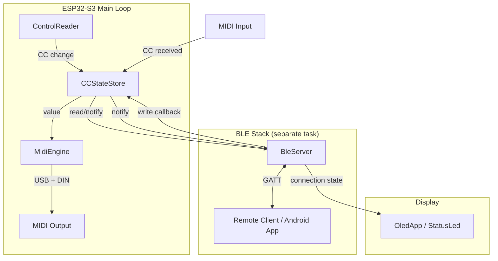
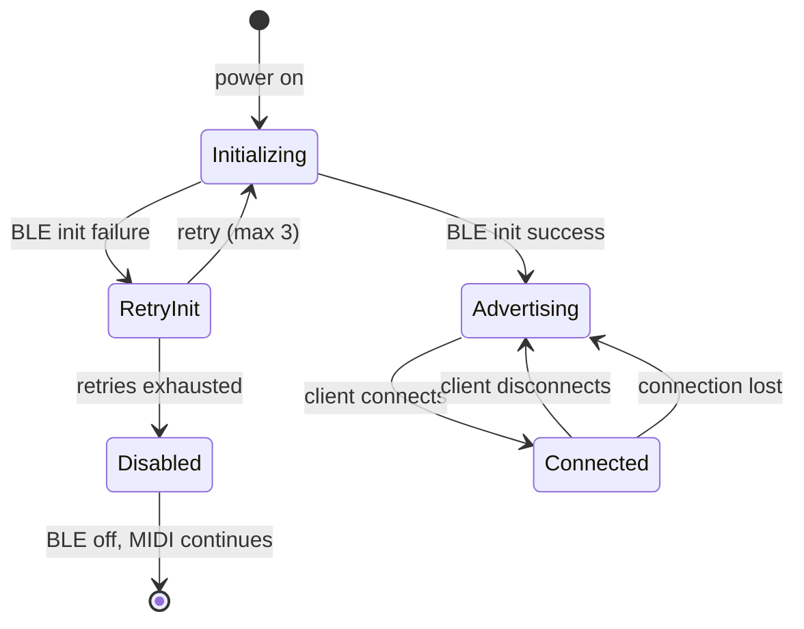

# Design Document: Bluetooth Remote Control

## Overview

This design adds BLE (Bluetooth Low Energy) remote control capability to the Modular MIDI Controller. The ESP32-S3 acts as a BLE GATT server, allowing an Android app to connect and remotely read/write all 2048 MIDI CC parameters (128 controllers × 16 channels). The design integrates with the existing `MidiEngine` and introduces a new `CCStateStore` as the single source of truth for CC values, plus a `BleServer` module that handles all BLE communication.

### Key Design Decisions

1. **Single-client model**: Only one BLE client at a time, simplifying state management and avoiding contention.
2. **3-byte binary protocol**: Minimal overhead for the constrained BLE MTU environment. Format: `[channel, controller_number, cc_value]`.
3. **Centralized CC State Store**: A shared, thread-safe data structure that both local controls and BLE writes update, ensuring consistency.
4. **Non-blocking architecture**: BLE operations run on the ESP-IDF BLE stack's own task/callbacks, never blocking the main MIDI processing loop.
5. **Snapshot-based bulk reads**: Atomic copy of channel state prevents torn reads during concurrent modifications.

## Architecture



### Data Flow

1. **Local control → MIDI out + BLE notification**: `ControlReader` reads potentiometer → updates `CCStateStore` → `MidiEngine.sendCC()` → `BleServer.notifyClient()` (if subscribed)
2. **BLE write → MIDI out**: `BleServer` receives GATT write → validates → updates `CCStateStore` → `MidiEngine.sendCC()`
3. **MIDI IN → Store + BLE notification**: `MidiEngine.update()` receives CC → updates `CCStateStore` → `BleServer.notifyClient()`
4. **BLE read**: `BleServer` receives GATT read → reads `CCStateStore` → returns 3-byte response

### Threading Model

The ESP-IDF BLE stack runs on its own FreeRTOS task. GATT callbacks execute in the BLE task context. The main loop runs on the Arduino `loop()` task. Synchronization between them uses a FreeRTOS mutex protecting the `CCStateStore`.

## Components and Interfaces

### 1. CCStateStore

Central repository for all CC parameter values. Thread-safe via FreeRTOS mutex.

```cpp
class CCStateStore {
public:
    /// Initialize all 2048 entries to 0
    void begin();

    /// Set a CC value. Returns true if valid, false if out of range.
    /// Thread-safe.
    bool set(uint8_t channel, uint8_t controller, uint8_t value);

    /// Get a CC value. Returns -1 if coordinates are invalid.
    /// Thread-safe.
    int16_t get(uint8_t channel, uint8_t controller) const;

    /// Copy all 128 CC values for a channel into buffer (atomic snapshot).
    /// Returns false if channel is invalid.
    bool getChannelSnapshot(uint8_t channel, uint8_t outBuffer[128]) const;

    /// Register a callback for value changes (called after set succeeds).
    using ChangeCallback = void (*)(uint8_t channel, uint8_t controller, uint8_t value);
    void onChange(ChangeCallback callback);

private:
    mutable SemaphoreHandle_t _mutex;
    uint8_t _values[16][128]; // [channel-1][controller]
    ChangeCallback _changeCallback = nullptr;
};
```

### 2. BleProtocol

Stateless utility for parsing and serializing the 3-byte BLE protocol messages.

```cpp
struct CCMessage {
    uint8_t channel;    // 1-16
    uint8_t controller; // 0-127
    uint8_t value;      // 0-127
};

enum class ParseResult {
    OK,
    ERROR_TOO_SHORT,
    ERROR_INVALID_CHANNEL,
    ERROR_INVALID_CONTROLLER,
    ERROR_INVALID_VALUE
};

class BleProtocol {
public:
    /// Parse a byte buffer into a CCMessage.
    /// If length > 3, only first 3 bytes are used.
    /// Returns ParseResult indicating success or specific error.
    static ParseResult parse(const uint8_t* data, size_t length, CCMessage& out);

    /// Serialize a CCMessage into a 3-byte buffer.
    /// Caller must provide buffer of at least 3 bytes.
    static void serialize(const CCMessage& msg, uint8_t* outBuffer);

    /// Validate a CCMessage (channel 1-16, controller 0-127, value 0-127).
    static bool isValid(const CCMessage& msg);
};
```

### 3. BleServer

Manages the BLE GATT server lifecycle, characteristics, and client interaction.

```cpp
class BleServer {
public:
    /// Initialize BLE stack and start advertising.
    /// Returns true on success, false on failure.
    bool begin();

    /// Stop BLE server and free resources.
    void stop();

    /// Check if a client is currently connected.
    bool isConnected() const;

    /// Send a CC change notification to the connected client (if subscribed).
    /// Non-blocking. Returns false if no client or not subscribed.
    bool notifyCC(uint8_t channel, uint8_t controller, uint8_t value);

    /// Set the CC State Store reference for read/write operations.
    void setCCStateStore(CCStateStore* store);

    /// Set the MidiEngine reference for forwarding BLE writes to MIDI.
    void setMidiEngine(MidiEngine* engine);

    /// Connection state callback type
    using ConnectionCallback = void (*)(bool connected, const char* address);
    void onConnectionChange(ConnectionCallback callback);

    /// Get initialization retry count (for diagnostics).
    uint8_t getRetryCount() const;

private:
    CCStateStore* _store = nullptr;
    MidiEngine* _engine = nullptr;
    ConnectionCallback _connectionCallback = nullptr;
    bool _connected = false;
    bool _clientSubscribed = false;
    uint8_t _retryCount = 0;

    // BLE handles (ESP-IDF NimBLE)
    // ...

    /// GATT write callback handler
    void handleCCWrite(const uint8_t* data, size_t length);

    /// GATT read callback handler
    void handleCCRead(uint8_t channel, uint8_t controller, uint8_t* outBuffer, size_t* outLength);

    /// GATT bulk read callback handler
    void handleBulkRead(uint8_t channel, uint8_t* outBuffer, size_t* outLength);

    /// Start BLE advertising
    void startAdvertising();

    /// Stop BLE advertising
    void stopAdvertising();
};
```

### 4. Integration Points

**Modified: `ControlReader`** — After sending CC via `MidiEngine`, also updates `CCStateStore`.

**Modified: `MidiEngine`** — The `onCCReceived` callback chain now also updates `CCStateStore`.

**Modified: `main.cpp`** — Instantiates `CCStateStore` and `BleServer`, wires callbacks, adds BLE initialization to the boot sequence (after step [6] LED, before step [7] app/display).

### GATT Service Structure

| Element | UUID | Properties |
|---------|------|-----------|
| MIDI CC Service | `0000ff00-0000-1000-8000-00805f9b34fb` | Primary Service |
| CC Read/Write Characteristic | `0000ff01-...` | Read, Write, Notify |
| Bulk Read Characteristic | `0000ff02-...` | Read (Long Read / Read Blob) |
| Client Characteristic Configuration Descriptor (CCCD) | Standard 0x2902 | Read, Write |

## Data Models

### CC State Store Memory Layout

```
uint8_t _values[16][128]
         ↑         ↑
     channel-1  controller number

Total: 16 × 128 = 2048 bytes
```

All values initialized to 0 on boot. Access protected by FreeRTOS mutex (`xSemaphoreTake`/`xSemaphoreGive`).

### BLE Protocol Message Format

```
Byte 0: channel        (valid: 1–16)
Byte 1: controller_number (valid: 0–127)
Byte 2: cc_value       (valid: 0–127)
```

Used identically for:

- Write commands (client → server)
- Read responses (server → client)
- Change notifications (server → client)

### Bulk Read Response Format

```
Request:  1 byte  — channel (1–16)
Response: 128 bytes — CC values for controllers 0–127 in ascending order
```

Uses BLE ATT Long Read (Read Blob) when response exceeds MTU. The 128-byte payload is captured as an atomic snapshot at the start of the read.

### Connection State Machine



## Correctness Properties

*A property is a characteristic or behavior that should hold true across all valid executions of a system — essentially, a formal statement about what the system should do. Properties serve as the bridge between human-readable specifications and machine-verifiable correctness guarantees.*

### Property 1: Protocol message round-trip

*For any* valid CCMessage (channel in 1–16, controller in 0–127, value in 0–127), serializing the message to a 3-byte buffer and then parsing that buffer back should produce a CCMessage identical to the original.

**Validates: Requirements 5.4, 3.1, 5.1**

### Property 2: CC State Store round-trip

*For any* valid channel (1–16), controller number (0–127), and value (0–127), writing the value to the CCStateStore and then reading it back should return the exact value that was written.

**Validates: Requirements 2.1, 2.5, 4.3**

### Property 3: Invalid coordinates rejection

*For any* channel outside 1–16 or controller number outside 0–127, both the CCStateStore `get()` and `set()` operations, the BLE read handler, and the bulk read handler should reject the request and return an error indication without modifying any stored value.

**Validates: Requirements 2.6, 4.5, 9.4**

### Property 4: Valid CC write propagation

*For any* valid 3-byte BLE write message (channel 1–16, controller 0–127, value 0–127), processing the write should result in both the CCStateStore being updated with the new value AND the MidiEngine receiving a sendCC call with the corresponding channel, controller, and value.

**Validates: Requirements 3.2, 3.3, 7.3**

### Property 5: Invalid CC write rejection

*For any* 3-byte message where at least one field is outside its valid range (channel not in 1–16, controller not in 0–127, or value not in 0–127), the BLE server should reject the write, leave the CCStateStore unchanged, and NOT call MidiEngine.sendCC.

**Validates: Requirements 3.4, 3.5, 3.6, 3.7, 5.7**

### Property 6: Extra bytes tolerance

*For any* byte sequence longer than 3 bytes where the first 3 bytes form a valid CC message, processing the full sequence should produce the same result (same store update, same MIDI send) as processing only the first 3 bytes.

**Validates: Requirements 5.6**

### Property 7: CC change notification format

*For any* CC value change in the CCStateStore (channel 1–16, controller 0–127, new value 0–127) while a client is subscribed, the BLE notification payload should be exactly 3 bytes encoding [channel, controller, value] — identical to what `BleProtocol::serialize` produces for that CCMessage.

**Validates: Requirements 4.2, 5.3**

### Property 8: Last-write-wins concurrency

*For any* sequence of two writes to the same (channel, controller) pair with values A and B where B is written last, the CCStateStore should contain value B regardless of whether the writes originated from local controls, MIDI IN, or BLE.

**Validates: Requirements 7.4**

### Property 9: Bulk read ordered snapshot

*For any* valid channel (1–16) and any state of the CCStateStore, a bulk read should return exactly 128 bytes where byte at index N equals the stored CC value for controller N on that channel, in ascending controller-number order (0, 1, 2, ..., 127).

**Validates: Requirements 9.3**

### Property 10: Bulk read snapshot isolation

*For any* concurrent modification to the CCStateStore that occurs after a bulk read has begun (snapshot taken), the bulk read response should still reflect the values captured at the start of the read, not the modified values.

**Validates: Requirements 9.5**

## Error Handling

### BLE Initialization Failure

| Scenario | Action |
|----------|--------|
| BLE init fails | Retry up to 3 times with 1000ms delay |
| All retries exhausted | Report error to display, disable BLE, continue MIDI operation |
| BLE stack crash at runtime | Catch exception, report to display, disable BLE |

### Protocol Errors

| Scenario | Action |
|----------|--------|
| Message < 3 bytes | Return BLE ATT error `INVALID_ATTR_VALUE_LEN`, discard |
| Channel outside 1–16 | Return BLE ATT error `VALUE_NOT_ALLOWED`, discard |
| Controller outside 0–127 | Return BLE ATT error `VALUE_NOT_ALLOWED`, discard |
| Value outside 0–127 | Return BLE ATT error `VALUE_NOT_ALLOWED`, discard |
| Bulk read invalid channel | Return BLE ATT error `VALUE_NOT_ALLOWED` |

### Connection Errors

| Scenario | Action |
|----------|--------|
| Unexpected disconnect | Resume advertising within 500ms |
| Second client attempts connection | Reject with BLE connection refused |
| Notification send failure | Log warning, retain store value, continue operation |
| Write processing exceeds 20ms | Discard command, continue processing |

### Resource Protection

- FreeRTOS mutex timeout: If mutex cannot be acquired within 5ms, the operation fails gracefully (read returns error, write is discarded).
- RAM budget: `BleServer` application layer limited to 10KB (excluding ESP-IDF BLE stack and CCStateStore's 2KB array).

## Testing Strategy

### Property-Based Tests (PBT)

The feature's core logic (protocol parsing, state store operations, validation) is well-suited for property-based testing. These are pure functions or have clear input/output behavior with large input spaces.

**Library**: [Rapidcheck](https://github.com/emil-e/rapidcheck) (C++ property-based testing library compatible with PlatformIO/native builds)

**Configuration**:

- Minimum 100 iterations per property test
- Each test tagged with: `Feature: bluetooth-remote-control, Property {N}: {description}`
- Tests run in native environment (not on ESP32) using mocks for hardware dependencies

**Properties to implement**:

1. Protocol round-trip (Property 1)
2. State store round-trip (Property 2)
3. Invalid coordinates rejection (Property 3)
4. Valid write propagation (Property 4)
5. Invalid write rejection (Property 5)
6. Extra bytes tolerance (Property 6)
7. Notification format correctness (Property 7)
8. Last-write-wins (Property 8)
9. Bulk read ordering (Property 9)
10. Snapshot isolation (Property 10)

### Unit Tests (Example-Based)

- BLE initialization retry logic (mock BLE stack failures)
- Connection state transitions (connect, disconnect, reject second client)
- Subscription management (subscribe, unsubscribe, notification delivery)
- Power-on initialization (all values start at 0)
- Display callbacks on connection/disconnection events
- Notification discarded when no client connected

### Integration Tests (On-Device)

- End-to-end BLE write → MIDI output verification
- Local potentiometer change → BLE notification delivery
- Bulk read timing (< 200ms for 128 values)
- MIDI loop cycle time impact measurement (< 1ms overhead)
- Connection interval negotiation verification
- RAM usage measurement

### Test Environment

- **Native tests** (PBT + unit): Run on host machine using PlatformIO's `native` environment. Hardware dependencies (BLE stack, GPIO, MIDI interfaces) are mocked.
- **On-device tests**: Run on ESP32-S3 hardware for integration and performance validation. Use a BLE test client (nRF Connect or custom Python script with `bleak`).
