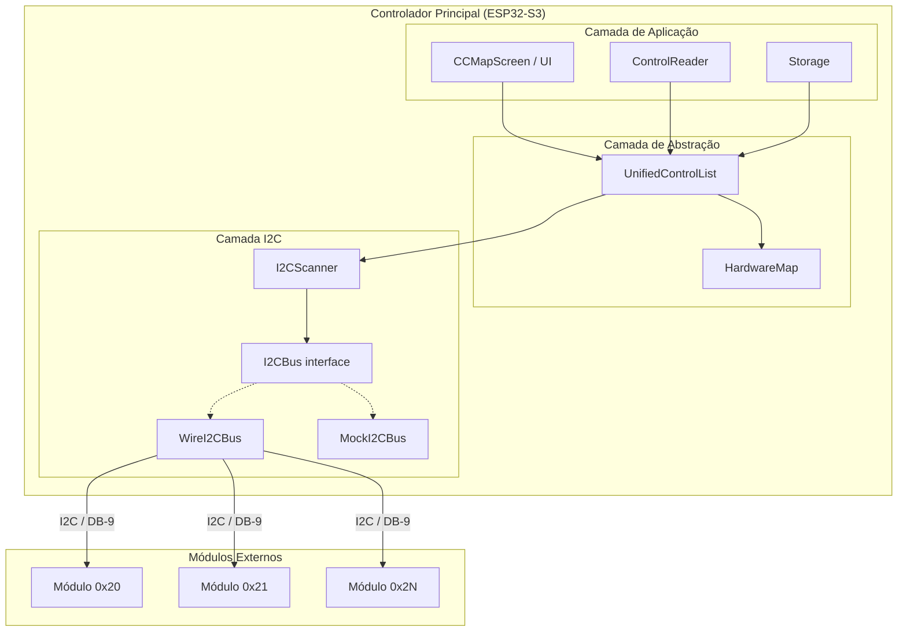
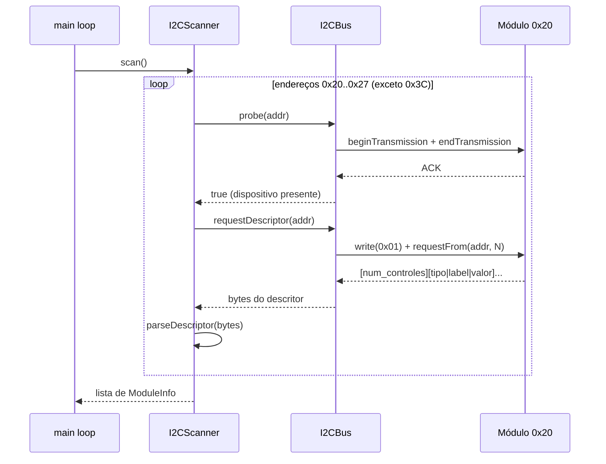
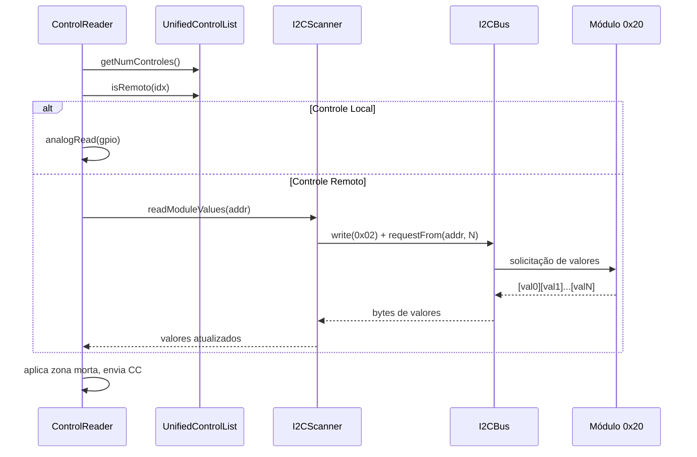

# Documento de Design: Expansão Modular I2C

## Visão Geral

O controlador MIDI atual opera exclusivamente com controles locais definidos em tempo de compilação no `HardwareMap`. Esta feature adiciona um sistema de expansão modular via barramento I2C, permitindo conectar módulos externos (PCBs com microcontroladores próprios) através de conectores DB-9. Cada módulo reporta seus controles via protocolo binário I2C, e o controlador principal os integra numa lista unificada junto com os controles locais.

A arquitetura é projetada para ser **puramente aditiva**: sem módulos conectados, o sistema opera de forma idêntica ao comportamento atual. A descoberta de módulos é automática via scanner I2C, e a persistência de configurações CC para controles remotos usa o NVS existente com chaves baseadas em endereço I2C + índice do controle.

O design prioriza testabilidade — como o usuário ainda não possui módulos físicos, toda a comunicação I2C é abstraída por uma interface `I2CBus` que permite injeção de um `MockI2CBus` nos testes nativos.

### Decisões de Design

1. **Interface `I2CBus` abstrata**: Permite trocar entre `WireI2CBus` (hardware real) e `MockI2CBus` (testes) sem alterar a lógica de negócio. Isso é essencial dado que o usuário não tem módulos físicos ainda.

2. **`UnifiedControlList` como fachada**: Em vez de modificar o `HardwareMap` (que é `constexpr`), criamos uma camada que combina controles locais e remotos sob uma interface uniforme. Componentes existentes (`CCMapScreen`, `ControlReader`, `Storage`) passam a consultar esta lista.

3. **Protocolo binário compacto**: O descritor de módulo usa formato binário fixo (1 + 14×N bytes) em vez de JSON ou outro formato textual, adequado para microcontroladores com pouca memória (ATtiny, Arduino Nano).

4. **Rescan periódico não-intrusivo**: A varredura periódica (5s) roda no loop principal mas é distribuída ao longo de vários ciclos para não bloquear a leitura de controles ou a UI.

## Arquitetura



### Diagrama de Sequência — Descoberta de Módulo



### Diagrama de Sequência — Leitura de Valores Remotos



## Componentes e Interfaces

### Componente 1: I2CBus (interface abstrata)

**Propósito**: Abstrair a comunicação I2C para permitir testes sem hardware real.

```cpp
// src/i2c/I2CBus.h
#pragma once
#include <cstdint>

class I2CBus {
public:
    virtual ~I2CBus() = default;

    /// Inicializa o barramento I2C.
    virtual void begin() = 0;

    /// Verifica se há dispositivo no endereço (probe).
    /// Retorna true se o dispositivo respondeu com ACK.
    virtual bool probe(uint8_t address) = 0;

    /// Envia bytes para o dispositivo no endereço.
    /// Retorna true se a transmissão foi bem-sucedida.
    virtual bool write(uint8_t address, const uint8_t* data, uint8_t length) = 0;

    /// Solicita N bytes do dispositivo no endereço.
    /// Retorna o número de bytes efetivamente lidos.
    /// Timeout de 50ms por transação.
    virtual uint8_t requestFrom(uint8_t address, uint8_t* buffer,
                                uint8_t length, uint32_t timeoutMs = 50) = 0;
};
```

### Componente 2: WireI2CBus (implementação hardware)

**Propósito**: Implementação real usando a biblioteca Wire do Arduino.

```cpp
// src/i2c/WireI2CBus.h
#pragma once
#include "i2c/I2CBus.h"

class WireI2CBus : public I2CBus {
public:
    void begin() override;
    bool probe(uint8_t address) override;
    bool write(uint8_t address, const uint8_t* data, uint8_t length) override;
    uint8_t requestFrom(uint8_t address, uint8_t* buffer,
                        uint8_t length, uint32_t timeoutMs = 50) override;
};
```

### Componente 3: MockI2CBus (implementação de teste)

**Propósito**: Simular módulos I2C para testes nativos sem hardware.

```cpp
// test/mocks/MockI2CBus.h
#pragma once
#include "i2c/I2CBus.h"
#include <cstring>

struct MockModule {
    uint8_t address;
    uint8_t numControles;
    uint8_t tipos[16];
    char labels[16][13];    // 12 chars + null
    uint8_t valores[16];
    bool respondePing;      // false = simula módulo desconectado
    bool respondeDescritor; // false = simula timeout no descritor
};

class MockI2CBus : public I2CBus {
public:
    static constexpr uint8_t MAX_MOCK_MODULES = 8;

    void begin() override;
    bool probe(uint8_t address) override;
    bool write(uint8_t address, const uint8_t* data, uint8_t length) override;
    uint8_t requestFrom(uint8_t address, uint8_t* buffer,
                        uint8_t length, uint32_t timeoutMs = 50) override;

    /// Registra um módulo simulado.
    void addModule(const MockModule& mod);

    /// Remove todos os módulos simulados.
    void clearModules();

    /// Altera o valor de um controle de um módulo simulado.
    void setControlValue(uint8_t address, uint8_t controlIdx, uint8_t value);

    /// Simula desconexão de um módulo.
    void setModuleConnected(uint8_t address, bool connected);

private:
    MockModule _modules[MAX_MOCK_MODULES];
    uint8_t _moduleCount = 0;
    uint8_t _lastCommand = 0;  // último comando recebido via write()

    MockModule* findModule(uint8_t address);
};
```

### Componente 4: ModuleDescriptor (modelo de dados + serialização)

**Propósito**: Representar e serializar/desserializar o descritor de um módulo externo.

```cpp
// src/i2c/ModuleDescriptor.h
#pragma once
#include <cstdint>
#include "hardware/HardwareMap.h"  // TipoControle

struct RemoteControl {
    TipoControle tipo;
    char label[13];     // 12 chars + null terminator
    uint8_t valor;      // 0-127
};

struct ModuleDescriptor {
    uint8_t numControles;                   // 1-16
    RemoteControl controles[16];

    /// Tamanho total em bytes quando serializado.
    /// 1 (numControles) + numControles * 14 (tipo:1 + label:12 + valor:1)
    uint16_t serializedSize() const;
};

/// Comandos do protocolo I2C
namespace I2CProtocol {
    constexpr uint8_t CMD_DESCRIPTOR = 0x01;
    constexpr uint8_t CMD_READ_VALUES = 0x02;

    constexpr uint8_t MAX_CONTROLES_POR_MODULO = 16;
    constexpr uint8_t LABEL_MAX_LEN = 12;
    constexpr uint8_t BYTES_POR_CONTROLE = 14;  // tipo:1 + label:12 + valor:1

    constexpr uint8_t ADDR_MIN = 0x20;
    constexpr uint8_t ADDR_MAX = 0x27;
    constexpr uint8_t ADDR_OLED = 0x3C;

    /// Serializa um ModuleDescriptor em buffer.
    /// Retorna o número de bytes escritos.
    uint16_t serialize(const ModuleDescriptor& desc, uint8_t* buffer, uint16_t bufferSize);

    /// Desserializa bytes em um ModuleDescriptor.
    /// Retorna true se o parsing foi bem-sucedido.
    bool deserialize(const uint8_t* buffer, uint16_t length, ModuleDescriptor& out);

    /// Valida se um tipo de controle é conhecido.
    bool isValidTipo(uint8_t tipo);
}
```

### Componente 5: I2CScanner

**Propósito**: Descobrir módulos conectados ao barramento I2C e gerenciar seu ciclo de vida.

```cpp
// src/i2c/I2CScanner.h
#pragma once
#include <cstdint>
#include "i2c/I2CBus.h"
#include "i2c/ModuleDescriptor.h"

struct ModuleInfo {
    uint8_t address;
    ModuleDescriptor descriptor;
    bool connected;
    uint8_t failCount;  // contagem de falhas consecutivas
};

class I2CScanner {
public:
    static constexpr uint8_t MAX_MODULES = 8;
    static constexpr uint8_t MAX_FAIL_COUNT = 3;
    static constexpr uint32_t RESCAN_INTERVAL_MS = 5000;

    explicit I2CScanner(I2CBus* bus);

    /// Varredura completa do barramento. Chamada na inicialização.
    /// Retorna o número de módulos descobertos.
    uint8_t scan();

    /// Varredura periódica (chamada no loop). Detecta conexões/desconexões.
    void periodicScan();

    /// Lê os valores atuais de todos os controles de um módulo.
    /// Retorna true se a leitura foi bem-sucedida.
    bool readValues(uint8_t moduleIndex, uint8_t* values, uint8_t maxLen);

    /// Retorna o número de módulos atualmente conectados.
    uint8_t getModuleCount() const;

    /// Retorna informações de um módulo pelo índice.
    const ModuleInfo* getModule(uint8_t index) const;

    /// Retorna o número total de controles remotos (soma de todos os módulos).
    uint8_t getTotalRemoteControls() const;

private:
    I2CBus* _bus;
    ModuleInfo _modules[MAX_MODULES];
    uint8_t _moduleCount = 0;
    uint32_t _lastScanTime = 0;

    /// Tenta ler o descritor de um módulo no endereço dado.
    bool probeAndRead(uint8_t address, ModuleDescriptor& desc);

    /// Incrementa falha de um módulo. Remove se exceder MAX_FAIL_COUNT.
    void registerFailure(uint8_t moduleIndex);
};
```

### Componente 6: UnifiedControlList

**Propósito**: Fachada que combina controles locais (HardwareMap) e remotos (I2CScanner) numa interface uniforme.

```cpp
// src/hardware/UnifiedControlList.h
#pragma once
#include <cstdint>
#include "hardware/HardwareMap.h"

class I2CScanner;

struct ControlInfo {
    const char* label;
    TipoControle tipo;
    uint8_t valor;          // valor atual (0-127)
    uint8_t ccPadrao;       // CC padrão
    bool isRemoto;          // true se vem de módulo externo
    uint8_t moduleAddress;  // endereço I2C (só para remotos)
    uint8_t moduleCtrlIdx;  // índice dentro do módulo (só para remotos)
};

class UnifiedControlList {
public:
    static constexpr uint8_t MAX_TOTAL_CONTROLS = 32;

    UnifiedControlList(I2CScanner* scanner);

    /// Reconstrói a lista unificada a partir do HardwareMap + módulos descobertos.
    void rebuild();

    /// Número total de controles (locais + remotos).
    uint8_t getNumControles() const;

    /// Número de controles locais.
    uint8_t getNumLocais() const;

    /// Retorna informações de um controle pelo índice unificado.
    /// Índices 0..N-1 = locais, N..M = remotos.
    bool getControlInfo(uint8_t index, ControlInfo& out) const;

    /// Retorna o label de um controle pelo índice unificado.
    const char* getLabel(uint8_t index) const;

    /// Retorna o tipo de um controle pelo índice unificado.
    TipoControle getTipo(uint8_t index) const;

    /// Verifica se o controle é analógico.
    bool isAnalogico(uint8_t index) const;

    /// Verifica se o controle é remoto.
    bool isRemoto(uint8_t index) const;

    /// Retorna o CC padrão do controle.
    uint8_t getCCPadrao(uint8_t index) const;

    /// Para controles remotos: retorna endereço I2C e índice no módulo.
    bool getRemoteInfo(uint8_t index, uint8_t& address, uint8_t& ctrlIdx) const;

private:
    I2CScanner* _scanner;
    ControlInfo _controls[MAX_TOTAL_CONTROLS];
    uint8_t _numControles = 0;
    uint8_t _numLocais = 0;
};
```

### Componente 7: Storage (extensão)

**Propósito**: Estender o Storage existente para persistir configurações de controles remotos.

```cpp
// Extensões ao Storage existente (src/storage/Storage.h)

class Storage {
public:
    // ... métodos existentes ...

    // ── Controles Remotos ────────────────────────────────
    /// Retorna o CC configurado para um controle remoto.
    /// Chave: endereço I2C + índice do controle.
    uint8_t getRemoteCC(uint8_t i2cAddr, uint8_t ctrlIdx) const;
    void setRemoteCC(uint8_t i2cAddr, uint8_t ctrlIdx, uint8_t cc);

    /// Retorna se um controle remoto está habilitado.
    bool isRemoteEnabled(uint8_t i2cAddr, uint8_t ctrlIdx) const;
    void setRemoteEnabled(uint8_t i2cAddr, uint8_t ctrlIdx, bool enabled);

    /// Carrega configurações salvas para um módulo redescoberto.
    /// Retorna true se havia configurações salvas.
    bool loadRemoteConfig(uint8_t i2cAddr, uint8_t ctrlIdx,
                          uint8_t& cc, bool& enabled) const;

private:
    // Estrutura para cache de configurações remotas
    struct RemoteCCConfig {
        uint8_t cc;
        bool enabled;
        bool hasData;  // true se foi carregado do NVS
    };

    // Cache: 8 endereços × 16 controles = 128 entradas
    RemoteCCConfig _remoteConfig[8][16];
};
```

### Componente 8: ControlReader (extensão)

**Propósito**: Estender o ControlReader para ler controles remotos além dos locais.

A extensão principal é que o `ControlReader` passa a usar a `UnifiedControlList` para iterar sobre todos os controles, e para controles remotos, obtém os valores via `I2CScanner::readValues()` em vez de `analogRead()`.

### Componente 9: CCMapScreen (extensão)

**Propósito**: Estender a tela de mapeamento CC para exibir e editar controles remotos.

A extensão principal é que a `CCMapScreen` passa a usar a `UnifiedControlList` para listar controles, e exibe um prefixo `[XX]` (endereço I2C hex) para controles remotos. O fluxo de edição (CC → ON/OFF) permanece idêntico.

## Modelos de Dados

### ModuleDescriptor — Formato Binário

O descritor é transmitido via I2C no seguinte formato:

```
Byte 0:       num_controles (1-16)
Bytes 1-14:   Controle 0: [tipo:1][label:12][valor:1]
Bytes 15-28:  Controle 1: [tipo:1][label:12][valor:1]
...
```

| Campo          | Tamanho | Intervalo       | Descrição                          |
|----------------|---------|------------------|------------------------------------|
| num_controles  | 1 byte  | 1-16             | Quantidade de controles no módulo  |
| tipo           | 1 byte  | 0-3              | TipoControle (BOTAO=0, POT=1, SENSOR=2, ENCODER=3) |
| label          | 12 bytes| ASCII, null-padded | Nome do controle                 |
| valor          | 1 byte  | 0-127            | Valor atual do controle            |

**Tamanho total**: 1 + (N × 14) bytes, onde N = num_controles.
**Tamanho máximo**: 1 + (16 × 14) = 225 bytes.

### Tipos de Controle (reutiliza enum existente)

```cpp
enum class TipoControle : uint8_t {
    BOTAO         = 0,
    POTENCIOMETRO = 1,
    SENSOR        = 2,
    ENCODER       = 3
};
```

### Chaves NVS para Controles Remotos

O Storage persiste configurações remotas usando chaves derivadas do endereço I2C e índice:

| Chave NVS       | Formato          | Exemplo          | Descrição                    |
|------------------|------------------|------------------|------------------------------|
| `rccAAII`        | AA=addr, II=idx  | `rcc2003`        | CC do controle 3 do módulo 0x20 |
| `renAAII`        | AA=addr, II=idx  | `ren2003`        | Habilitado do controle 3 do módulo 0x20 |

**Capacidade**: 8 endereços × 16 controles = 128 pares de chaves.

### Pinagem DB-9

```
Conector DB-9 (vista frontal, lado solda):

    1   2   3   4   5
      6   7   8   9

Pino 1: SDA (dados I2C)
Pino 2: SCL (clock I2C)
Pino 3: VCC (3.3V ou 5V conforme módulo)
Pino 4: GND
Pino 5: Reservado (futuro)
Pino 6: Reservado (futuro)
Pino 7: Reservado (futuro)
Pino 8: Reservado (futuro)
Pino 9: Reservado (futuro)

Pull-ups: 4.7kΩ em SDA e SCL (no controlador principal)
Velocidade: 100kHz (I2C standard mode)
```

### ModuleInfo — Estado em Runtime

```cpp
struct ModuleInfo {
    uint8_t address;           // 0x20-0x27
    ModuleDescriptor descriptor;
    bool connected;            // true se respondendo
    uint8_t failCount;         // 0-3, remove ao atingir 3
};
```

### UnifiedControlList — Mapeamento de Índices

```
Índice 0          → HardwareMap::CONTROLES[0]  (local)
Índice 1          → HardwareMap::CONTROLES[1]  (local)
...
Índice N-1        → HardwareMap::CONTROLES[N-1] (local)
Índice N          → Módulo 0x20, controle 0     (remoto)
Índice N+1        → Módulo 0x20, controle 1     (remoto)
...
Índice N+M-1      → Módulo 0x27, controle K     (remoto)

Onde N = HardwareMap::NUM_CONTROLES, M = total de controles remotos
Máximo: N + M ≤ 32
```

## Propriedades de Corretude

*Uma propriedade é uma característica ou comportamento que deve ser verdadeiro em todas as execuções válidas de um sistema — essencialmente, uma declaração formal sobre o que o sistema deve fazer. Propriedades servem como ponte entre especificações legíveis por humanos e garantias de corretude verificáveis por máquina.*

### Property 1: Modo standalone preserva comportamento local

*Para qualquer* índice válido de controle local (0 a N-1, onde N = HardwareMap::NUM_CONTROLES), quando a UnifiedControlList é construída sem módulos externos, o label, tipo e CC padrão retornados pela lista unificada devem ser idênticos aos retornados pelo HardwareMap, e `isRemoto()` deve retornar false.

**Validates: Requirements 1.1, 1.4, 4.5**

### Property 2: Scanner registra módulos com descritores válidos

*Para qualquer* conjunto de MockModules com descritores válidos (1-16 controles, tipos conhecidos, labels ASCII) registrados no MockI2CBus em endereços distintos no intervalo 0x20-0x27, após `scan()`, o número de módulos descobertos deve ser igual ao número de MockModules registrados, e cada módulo deve ter endereço, numControles, tipos e labels correspondentes.

**Validates: Requirements 2.3, 2.6**

### Property 3: Round-trip de serialização do ModuleDescriptor

*Para qualquer* ModuleDescriptor válido (numControles entre 1 e 16, tipos conhecidos, labels de até 12 caracteres ASCII, valores entre 0 e 127), serializar e depois desserializar deve produzir um ModuleDescriptor equivalente ao original — mesmo numControles, mesmos tipos, mesmos labels e mesmos valores para cada controle.

**Validates: Requirements 3.2, 11.2, 11.4**

### Property 4: Leitura de valores remotos preserva dados

*Para qualquer* módulo com N controles (1-16) e quaisquer valores (0-127) configurados no MockI2CBus, a leitura via `I2CScanner::readValues()` deve retornar exatamente os mesmos N valores na mesma ordem.

**Validates: Requirements 3.3**

### Property 5: Resiliência — últimos valores mantidos após falha

*Para qualquer* módulo com valores conhecidos, se uma leitura bem-sucedida for seguida de uma falha de comunicação (mock configurado para não responder), os valores retornados pela última leitura bem-sucedida devem ser preservados e acessíveis.

**Validates: Requirements 3.5, 5.4, 10.1**

### Property 6: Ordenação da lista unificada — locais primeiro, remotos depois

*Para qualquer* configuração de módulos externos, após `rebuild()`, todos os índices de 0 a numLocais-1 na UnifiedControlList devem retornar `isRemoto() == false`, e todos os índices de numLocais em diante devem retornar `isRemoto() == true`.

**Validates: Requirements 4.1**

### Property 7: Dados de controles remotos correspondem ao descritor

*Para qualquer* ModuleDescriptor válido registrado via MockI2CBus, após scan e rebuild da UnifiedControlList, cada controle remoto na lista unificada deve ter label, tipo e CC padrão idênticos aos do descritor do módulo correspondente.

**Validates: Requirements 4.3, 4.4, 4.6**

### Property 8: Zona morta aplicada uniformemente a controles remotos

*Para quaisquer* dois valores consecutivos de um controle remoto (v1, v2), uma mensagem MIDI CC deve ser enviada se e somente se `|v2 - v1| > ZONA_MORTA`. Valores dentro da zona morta não devem gerar envio.

**Validates: Requirements 5.2, 5.5**

### Property 9: Round-trip de persistência de configuração remota

*Para qualquer* endereço I2C válido (0x20-0x27), índice de controle (0-15), valor CC (0-127) e estado habilitado (true/false), após `setRemoteCC()` e `setRemoteEnabled()`, as chamadas `getRemoteCC()` e `isRemoteEnabled()` devem retornar os mesmos valores configurados.

**Validates: Requirements 6.1, 6.2, 6.3**

### Property 10: Formatação de label remoto inclui prefixo de endereço

*Para qualquer* controle remoto com endereço I2C no intervalo 0x20-0x27 e qualquer label de até 12 caracteres, o label formatado para exibição na CCMapScreen deve conter o prefixo `[XX]` onde XX é a representação hexadecimal do endereço (ex: `[20]`, `[27]`).

**Validates: Requirements 7.2**

### Property 11: Desconexão após 3 falhas consecutivas

*Para qualquer* módulo conectado, se exatamente 3 leituras consecutivas falharem, o módulo deve ser marcado como desconectado e seus controles removidos da lista unificada. Com menos de 3 falhas consecutivas, o módulo deve permanecer conectado.

**Validates: Requirements 10.2**

### Property 12: Desserialização rejeita dados inválidos

*Para qualquer* sequência de bytes onde numControles é 0 ou maior que 16, ou onde um byte de tipo não corresponde a um TipoControle conhecido, `deserialize()` deve retornar false e não produzir um ModuleDescriptor parcialmente preenchido.

**Validates: Requirements 11.3, 11.5**

## Tratamento de Erros

### Cenário 1: Módulo não responde ao probe

**Condição**: `I2CBus::probe(address)` retorna false (NACK)
**Resposta**: Scanner ignora o endereço e continua para o próximo.
**Impacto**: Nenhum — endereço simplesmente não é registrado.

### Cenário 2: Módulo responde ao probe mas não ao descritor

**Condição**: `probe()` retorna true, mas `requestFrom()` retorna 0 bytes ou timeout (100ms).
**Resposta**: Scanner ignora o endereço e registra log de warning. Continua varredura.
**Impacto**: Módulo não é adicionado à lista. Pode ser redescoberto na próxima varredura periódica.

### Cenário 3: Descritor com dados inválidos

**Condição**: Bytes recebidos não conformam ao formato (numControles=0, tipo desconhecido, etc.)
**Resposta**: `deserialize()` retorna false. Scanner ignora o módulo e registra log de erro.
**Impacto**: Módulo não é adicionado. Dados corrompidos não propagam para a lista unificada.

### Cenário 4: Falha de leitura de valores durante operação

**Condição**: `readValues()` falha (timeout ou NACK) durante operação normal.
**Resposta**: `failCount` do módulo é incrementado. Últimos valores conhecidos são mantidos. Se `failCount >= 3`, módulo é marcado como desconectado e removido da lista unificada.
**Impacto**: Controles remotos do módulo param de atualizar, mas controles locais e outros módulos continuam normalmente.

### Cenário 5: Módulo desconectado reconecta

**Condição**: Módulo previamente marcado como desconectado responde novamente durante varredura periódica.
**Resposta**: Scanner redescobre o módulo, lê novo descritor, restaura configurações do Storage, e adiciona controles de volta à lista unificada.
**Impacto**: Controles remotos voltam a funcionar com as configurações salvas.

### Cenário 6: Excesso de controles totais (> 32)

**Condição**: Soma de controles locais + remotos excede MAX_TOTAL_CONTROLS (32).
**Resposta**: `UnifiedControlList::rebuild()` para de adicionar controles remotos ao atingir o limite. Módulos descobertos por último podem ter controles parcialmente incluídos.
**Impacto**: Alguns controles remotos não aparecem na lista. Log de warning emitido.

### Cenário 7: Endereço 0x3C detectado na varredura

**Condição**: Scanner encontra dispositivo no endereço 0x3C (display OLED).
**Resposta**: Endereço é ignorado — o loop de varredura pula 0x3C explicitamente.
**Impacto**: Nenhum — display OLED não é tratado como módulo.

## Estratégia de Testes

### Abordagem Geral

O projeto usa **Unity Test Framework** no ambiente `native` do PlatformIO. Testes de propriedade são implementados com um gerador LCG pseudo-aleatório (padrão já estabelecido no projeto — ver `test_state_pbt`). A abstração `I2CBus` + `MockI2CBus` permite testar toda a lógica de descoberta, leitura e resiliência sem hardware real.

### Testes de Propriedade (PBT)

Cada propriedade do design será implementada como um teste PBT com mínimo de **100 iterações** usando o gerador LCG. Cada teste referencia a propriedade do design via comentário:

**Tag format**: `Feature: i2c-modular-expansion, Property {N}: {título}`

| Propriedade | Teste PBT | Iterações |
|-------------|-----------|-----------|
| Property 1  | `test_property1_standalone_preserves_local` | 100 |
| Property 2  | `test_property2_scanner_registers_valid_modules` | 100 |
| Property 3  | `test_property3_descriptor_roundtrip` | 100 |
| Property 4  | `test_property4_value_reading_preserves_data` | 100 |
| Property 5  | `test_property5_resilience_last_values` | 100 |
| Property 6  | `test_property6_ordering_locals_first` | 100 |
| Property 7  | `test_property7_remote_data_matches_descriptor` | 100 |
| Property 8  | `test_property8_dead_zone_uniform` | 100 |
| Property 9  | `test_property9_storage_remote_roundtrip` | 100 |
| Property 10 | `test_property10_label_prefix_format` | 100 |
| Property 11 | `test_property11_disconnect_after_3_failures` | 100 |
| Property 12 | `test_property12_deserialize_rejects_invalid` | 100 |

### Testes Unitários (Exemplos)

Testes unitários complementam os PBTs com cenários específicos:

1. **Scanner**:
   - `test_scan_empty_bus`: Varredura sem módulos retorna 0.
   - `test_scan_skips_0x3C`: Endereço do OLED é ignorado.
   - `test_scan_timeout_skips_module`: Módulo que não responde ao descritor é ignorado.
   - `test_periodic_scan_interval`: Varredura periódica respeita intervalo de 5s.

2. **UnifiedControlList**:
   - `test_rebuild_no_modules`: Lista contém apenas locais quando sem módulos.
   - `test_rebuild_max_controls`: Lista respeita limite de 32 controles.
   - `test_rebuild_after_disconnect`: Lista é atualizada após desconexão de módulo.

3. **Storage (extensão)**:
   - `test_remote_config_persists`: Configuração salva é recuperável.
   - `test_remote_config_survives_absence`: Config mantida quando módulo ausente.
   - `test_remote_config_capacity`: Suporta 8×16 = 128 configurações.

4. **CCMapScreen (extensão)**:
   - `test_ccmap_shows_remote_after_local`: Controles remotos aparecem após locais.
   - `test_ccmap_edit_remote_same_flow`: Fluxo de edição idêntico para remotos.
   - `test_ccmap_standalone_no_remote`: Sem módulos, apenas locais visíveis.

5. **MockI2CBus**:
   - `test_mock_probe_responds`: Mock responde a probe corretamente.
   - `test_mock_descriptor_response`: Mock retorna descritor configurado.
   - `test_mock_value_update`: Alteração de valores reflete na leitura.
   - `test_mock_disconnect_simulation`: Mock simula desconexão.

### Testes de Integração

Testes que verificam o fluxo completo entre componentes:

1. **Fluxo completo de descoberta**: Scanner → UnifiedControlList → CCMapScreen
2. **Fluxo de leitura + envio CC**: Scanner → ControlReader → MidiEngine
3. **Fluxo de persistência**: CCMapScreen → Storage → reconexão → Storage restaura

### Estrutura de Arquivos de Teste

```
test/
├── mocks/
│   ├── MockI2CBus.h          # Mock do barramento I2C
│   ├── MockI2CBus.cpp
│   └── Wire.h                # Mock existente (atualizar se necessário)
├── test_i2c_scanner/
│   └── test_i2c_scanner.cpp  # Testes unitários do scanner
├── test_i2c_scanner_pbt/
│   └── test_i2c_scanner_pbt.cpp  # PBT: Properties 2, 4, 5, 11
├── test_descriptor_pbt/
│   └── test_descriptor_pbt.cpp   # PBT: Properties 3, 12
├── test_unified_list/
│   └── test_unified_list.cpp     # Testes unitários da lista unificada
├── test_unified_list_pbt/
│   └── test_unified_list_pbt.cpp # PBT: Properties 1, 6, 7
├── test_remote_storage_pbt/
│   └── test_remote_storage_pbt.cpp # PBT: Property 9
├── test_remote_reader_pbt/
│   └── test_remote_reader_pbt.cpp  # PBT: Property 8
└── test_ccmap_remote/
    └── test_ccmap_remote.cpp       # Testes unitários + PBT Property 10
```

### Dependências de Teste

- **Unity Test Framework**: Já configurado no projeto (`[env:native]`)
- **MockI2CBus**: Novo mock a ser criado (substitui Wire para testes de I2C)
- **LCG pseudo-random**: Padrão já estabelecido no projeto para PBTs
- **Mocks existentes**: Adafruit_SSD1306, Arduino, Control_Surface (já disponíveis)
