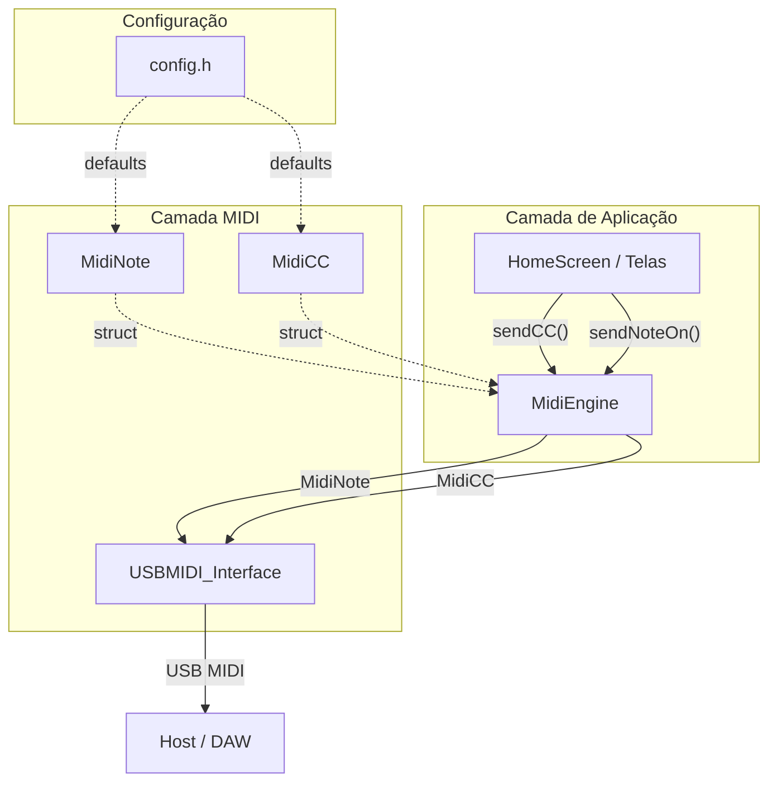
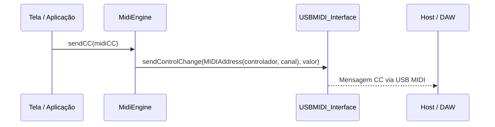
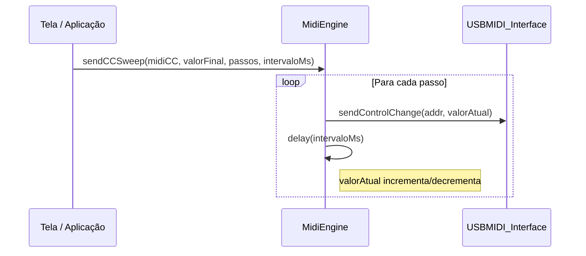

# Documento de Design: MIDI CC Control

## Visão Geral

O sistema MIDI atual suporta apenas mensagens de nota (NoteOn/NoteOff) através do `MidiEngine`. Esta feature adiciona suporte a mensagens MIDI CC (Control Change), permitindo o controle de parâmetros como volume, pan, modulação e outros controladores MIDI padrão. Mensagens CC são compostas por: número do controlador (0-127), valor (0-127) e canal (1-16).

A implementação segue o padrão já estabelecido no projeto: uma struct `MidiCC` análoga à `MidiNote`, novos métodos no `MidiEngine`, extensão do sistema de mocks para testes, e constantes de configuração padrão. A abordagem é minimalista e consistente com a arquitetura existente, mantendo a nomenclatura em português.

## Arquitetura



## Diagrama de Sequência

### Envio de mensagem CC



### Envio de CC com varredura (sweep)



## Componentes e Interfaces

### Componente 1: MidiCC (struct)

**Propósito**: Representar uma mensagem MIDI Control Change com controlador, valor e canal.

**Interface**:

```cpp
// src/midi/MidiCC.h
#pragma once
#include <Control_Surface.h>
#include "config.h"

struct MidiCC {
    uint8_t controlador;  // Número do controlador CC (0-127)
    uint8_t valor;        // Valor do CC (0-127)
    uint8_t canal;        // Canal MIDI (1-16)

    MidiCC(uint8_t controlador,
           uint8_t valor = MIDI_DEFAULT_CC_VALUE,
           uint8_t canal = MIDI_DEFAULT_CHANNEL)
        : controlador(controlador), valor(valor), canal(canal) {}
};
```

**Responsabilidades**:

- Armazenar os três parâmetros de uma mensagem CC
- Fornecer valores padrão via config.h
- Seguir o mesmo padrão de construção da `MidiNote`

### Componente 2: MidiEngine (extensão)

**Propósito**: Adicionar métodos de envio de CC ao engine MIDI existente.

**Interface estendida**:

```cpp
// src/midi/MidiEngine.h (adições)
#pragma once
#include <Control_Surface.h>
#include "MidiNote.h"
#include "MidiCC.h"

class MidiEngine {
public:
    void begin();

    // Métodos existentes (notas)
    void sendNoteOn(const MidiNote& note);
    void sendNoteOff(const MidiNote& note);
    void sendNoteOnOff(const MidiNote& note, uint16_t duracaoMs);

    // Novos métodos (CC)
    void sendCC(const MidiCC& cc);

private:
    USBMIDI_Interface _midi;
};
```

**Responsabilidades**:

- `sendCC()`: Enviar uma mensagem CC única via USBMIDI_Interface
- Delegar ao `_midi.sendControlChange()` da biblioteca Control_Surface

### Componente 3: Mock USBMIDI_Interface (extensão)

**Propósito**: Estender o mock para capturar e verificar mensagens CC nos testes.

**Interface estendida**:

```cpp
// test/mocks/Control_Surface.h (adições ao namespace mock_midi)
namespace mock_midi {
    struct MidiMessage {
        uint8_t note;       // Usado para notas
        uint8_t channel;
        uint8_t velocity;   // Usado para notas
        bool    isNoteOn;

        // Novos campos para CC
        uint8_t controller; // Número do controlador CC
        uint8_t ccValue;    // Valor do CC
        bool    isCC;       // true se a mensagem é CC
    };

    extern MidiMessage lastMessage;
    extern int         messageCount;
    void reset();
}

class USBMIDI_Interface {
public:
    void sendNoteOn(MIDIAddress addr, uint8_t velocity);
    void sendNoteOff(MIDIAddress addr, uint8_t velocity);

    // Novo método para CC
    void sendControlChange(MIDIAddress addr, uint8_t value);
};
```

## Modelos de Dados

### MidiCC

```cpp
struct MidiCC {
    uint8_t controlador;  // 0-127: número do controlador MIDI CC
    uint8_t valor;        // 0-127: valor do controlador
    uint8_t canal;        // 1-16: canal MIDI
};
```

**Regras de Validação**:

- `controlador` deve estar no intervalo [0, 127]
- `valor` deve estar no intervalo [0, 127]
- `canal` deve estar no intervalo [1, 16]
- Valores fora do intervalo são responsabilidade do chamador (consistente com MidiNote)

### Constantes de Configuração (config.h)

```cpp
// Novas constantes para CC
#define MIDI_DEFAULT_CC_VALUE  0
```

**Justificativa**: O valor padrão 0 é o mais seguro para CC, pois representa "desligado" ou "mínimo" para a maioria dos controladores.

### Controladores CC Comuns (referência)

| Controlador | Número | Descrição |
|-------------|--------|-----------|
| Modulation  | 1      | Roda de modulação |
| Volume      | 7      | Volume do canal |
| Pan         | 10     | Panorâmica esquerda/direita |
| Expression  | 11     | Expressão |
| Sustain     | 64     | Pedal de sustain (on/off) |
| All Notes Off | 123  | Desliga todas as notas |

## Pseudocódigo Algorítmico

### Algoritmo: sendCC

```cpp
// MidiEngine::sendCC
void MidiEngine::sendCC(const MidiCC& cc) {
    // Pré-condição: cc.controlador ∈ [0,127], cc.valor ∈ [0,127], cc.canal ∈ [1,16]
    _midi.sendControlChange(
        MIDIAddress(cc.controlador, Channel(cc.canal)),
        cc.valor
    );
    // Pós-condição: mensagem CC enviada via USB MIDI
}
```

**Pré-condições:**

- `cc` é uma referência válida a um `MidiCC`
- `cc.controlador` está no intervalo [0, 127]
- `cc.valor` está no intervalo [0, 127]
- `cc.canal` está no intervalo [1, 16]
- `_midi` (USBMIDI_Interface) está inicializado (begin() foi chamado)

**Pós-condições:**

- Uma mensagem MIDI CC foi enviada com o controlador, valor e canal especificados
- Nenhum efeito colateral no objeto `cc` (passado por const ref)
- `messageCount` do mock incrementado em 1 (em ambiente de teste)

**Invariantes de Loop:** N/A (operação atômica, sem loops)

### Algoritmo: sendControlChange (Mock)

```cpp
// USBMIDI_Interface::sendControlChange (mock)
void USBMIDI_Interface::sendControlChange(MIDIAddress addr, uint8_t value) {
    mock_midi::lastMessage = {
        .note = 0,
        .channel = addr.channel,
        .velocity = 0,
        .isNoteOn = false,
        .controller = addr.note,  // MIDIAddress.note armazena o número do controlador
        .ccValue = value,
        .isCC = true
    };
    mock_midi::messageCount++;
}
```

**Pré-condições:**

- `addr` contém controlador válido e canal válido
- `value` está no intervalo [0, 127]

**Pós-condições:**

- `mock_midi::lastMessage` atualizado com dados da mensagem CC
- `mock_midi::lastMessage.isCC` é `true`
- `mock_midi::messageCount` incrementado em 1
- Campos de nota (`note`, `velocity`, `isNoteOn`) zerados/false

## Funções-Chave com Especificações Formais

### Função: MidiCC::MidiCC (construtor)

```cpp
MidiCC(uint8_t controlador,
       uint8_t valor = MIDI_DEFAULT_CC_VALUE,
       uint8_t canal = MIDI_DEFAULT_CHANNEL);
```

**Pré-condições:**

- `controlador` fornecido pelo chamador
- `valor` e `canal` opcionais (defaults de config.h)

**Pós-condições:**

- `this->controlador == controlador`
- `this->valor == valor` (ou `MIDI_DEFAULT_CC_VALUE` se omitido)
- `this->canal == canal` (ou `MIDI_DEFAULT_CHANNEL` se omitido)

### Função: MidiEngine::sendCC

```cpp
void MidiEngine::sendCC(const MidiCC& cc);
```

**Pré-condições:**

- `MidiEngine::begin()` foi chamado previamente
- `cc` é uma referência válida

**Pós-condições:**

- Mensagem MIDI CC transmitida via USB com controlador, valor e canal corretos
- Nenhuma mutação no parâmetro `cc`

## Exemplo de Uso

```cpp
#include "midi/MidiEngine.h"
#include "midi/MidiCC.h"

MidiEngine engine;

void setup() {
    engine.begin();
}

void loop() {
    // Exemplo 1: Enviar CC de modulação (controlador 1) com valor 64
    MidiCC modulacao(1, 64);
    engine.sendCC(modulacao);

    // Exemplo 2: Enviar CC de volume (controlador 7) com valor máximo
    MidiCC volume(7, 127, 1);
    engine.sendCC(volume);

    // Exemplo 3: CC com valores padrão (valor=0, canal=1)
    MidiCC sustain(64);
    engine.sendCC(sustain);

    // Exemplo 4: Uso em HomeScreen com botão
    // if (event == ButtonEvent::PRESSED) {
    //     MidiCC cc(1, 127);  // Modulação máxima
    //     engine.sendCC(cc);
    // }
}
```

## Propriedades de Corretude

1. **Construção com defaults**: Para todo `MidiCC` construído apenas com `controlador`, `valor == MIDI_DEFAULT_CC_VALUE` e `canal == MIDI_DEFAULT_CHANNEL`.

2. **Construção com valores customizados**: Para todo `MidiCC(c, v, ch)`, `controlador == c`, `valor == v`, `canal == ch`.

3. **Envio CC preserva dados**: Para todo `MidiCC cc` enviado via `sendCC(cc)`, a mensagem capturada no mock contém `controller == cc.controlador`, `ccValue == cc.valor`, `channel == cc.canal`.

4. **Envio CC incrementa contador**: Para toda chamada `sendCC()`, `mock_midi::messageCount` incrementa exatamente 1.

5. **Tipo de mensagem CC**: Para toda mensagem enviada via `sendCC()`, `mock_midi::lastMessage.isCC == true`.

6. **Independência Note/CC**: Enviar uma mensagem CC não altera os campos de nota (`isNoteOn` permanece `false`, `velocity` permanece `0`).

7. **Independência CC/Note**: Enviar uma mensagem de nota após CC não altera os campos de CC da mensagem anterior (cada envio sobrescreve `lastMessage` completamente).

8. **Canal padrão compartilhado**: `MidiCC` e `MidiNote` usam o mesmo `MIDI_DEFAULT_CHANNEL`, garantindo consistência.

## Tratamento de Erros

### Cenário 1: Controlador fora do intervalo

**Condição**: `controlador > 127` (overflow de uint8_t impossível, mas valor semanticamente inválido)
**Resposta**: Nenhuma validação explícita (consistente com `MidiNote` que não valida `nota`)
**Justificativa**: O protocolo MIDI e a biblioteca Control_Surface tratam valores uint8_t diretamente. Validação é responsabilidade da camada de aplicação.

### Cenário 2: Canal inválido (0 ou > 16)

**Condição**: `canal == 0` ou `canal > 16`
**Resposta**: Comportamento delegado à biblioteca Control_Surface
**Justificativa**: Consistente com o tratamento existente em `MidiNote`

### Cenário 3: Engine não inicializado

**Condição**: `sendCC()` chamado antes de `begin()`
**Resposta**: Comportamento indefinido (mesmo padrão de `sendNoteOn`)
**Justificativa**: Manter consistência com a API existente

## Estratégia de Testes

### Testes Unitários

Seguindo o padrão existente em `test/test_midi/test_midi.cpp`:

1. **Construção de MidiCC**:
   - `test_midi_cc_default_value`: Verificar defaults (valor=0, canal=1)
   - `test_midi_cc_custom_values`: Verificar valores customizados

2. **Envio de CC**:
   - `test_send_cc`: Verificar que `sendCC()` envia mensagem correta
   - `test_send_cc_different_channel`: Verificar envio em canal diferente
   - `test_send_cc_max_values`: Verificar com valores máximos (127, 127, 16)

3. **Integração Note + CC**:
   - `test_send_note_then_cc`: Verificar que CC após nota funciona corretamente
   - `test_send_cc_then_note`: Verificar que nota após CC funciona corretamente
   - `test_multiple_cc_messages`: Verificar contagem de mensagens com múltiplos CCs

### Abordagem de Testes Baseados em Propriedades

**Biblioteca**: Não aplicável diretamente (projeto usa Unity test framework em C++). Propriedades verificadas via testes parametrizados manuais.

### Abordagem de Testes de Integração

- Verificar que `MidiEngine` envia CC e notas intercalados corretamente
- Verificar que o contador de mensagens (`messageCount`) é consistente após sequências mistas

## Considerações de Performance

- Mensagens CC são atômicas e leves (3 bytes MIDI)
- Nenhuma alocação dinâmica necessária (struct por valor)
- Consistente com o desempenho existente de NoteOn/NoteOff
- Em ESP32-S3, o envio USB MIDI é não-bloqueante

## Considerações de Segurança

- Não aplicável diretamente (sistema embarcado sem rede)
- Valores CC são limitados a uint8_t (0-255), protocolo MIDI usa apenas 7 bits (0-127)
- Nenhum dado sensível envolvido

## Dependências

- **Control_Surface** (v2.1.0+): Biblioteca que fornece `USBMIDI_Interface::sendControlChange()`
- **Unity Test Framework**: Framework de testes existente no projeto
- **config.h**: Arquivo de configuração para constantes padrão
