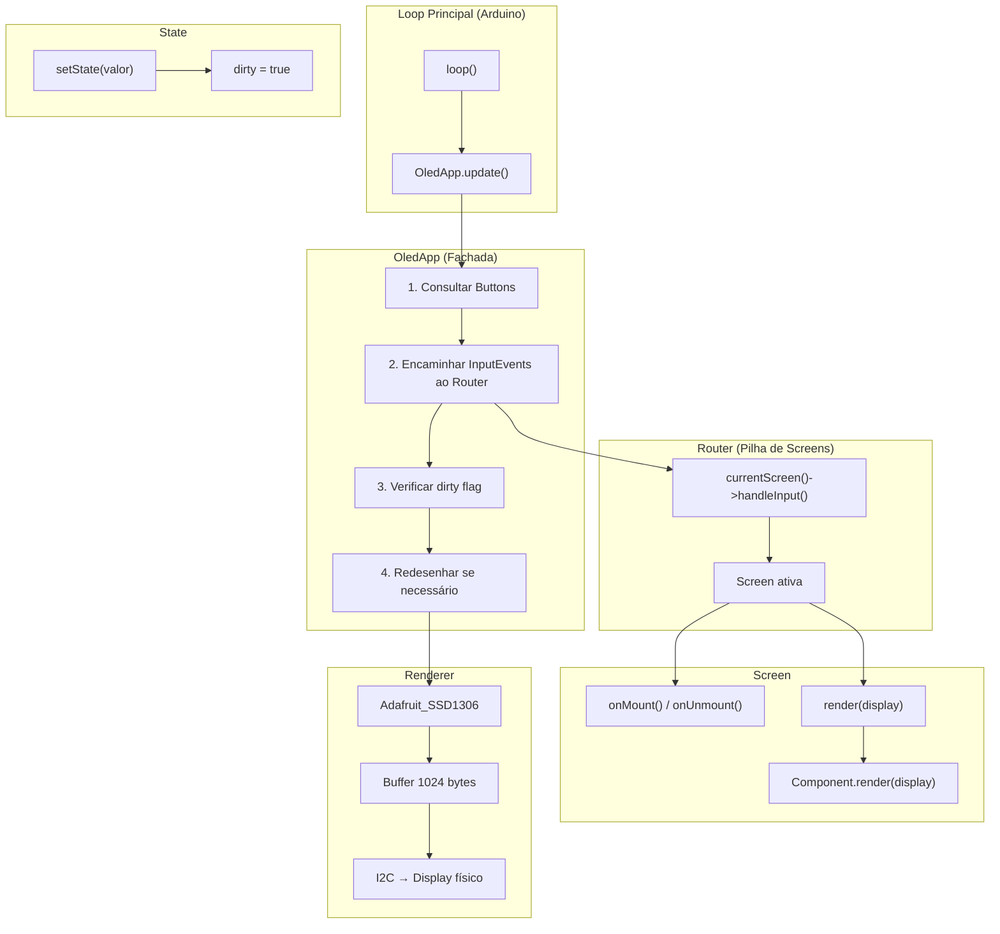

# Documento de Design — OLED UI Framework

## Visão Geral

Este documento descreve o design técnico do framework de interface gráfica para o display OLED SSD1306 128×64 (I2C) no projeto de instrumento musical baseado em ESP32-S3. O framework segue paradigmas inspirados em React — componentes declarativos, estado reativo e navegação por pilha de telas — implementados em C++ para ambiente embarcado (PlatformIO/Arduino).

O framework se integra ao sistema de botões (`Button`) já existente e à biblioteca Adafruit SSD1306/GFX para renderização. A arquitetura prioriza baixo consumo de memória RAM (alocação estática, sem `new`/`delete` em runtime) e eficiência de CPU (dirty flag para evitar redesenhos desnecessários, limitação a 30 FPS).

### Decisões de Design

1. **Composição sobre herança profunda**: Components usam uma interface base simples (`UIComponent`) com `render()` e `handleInput()`. Screens compõem components, não herdam deles.
2. **Estado reativo via dirty flag**: Em vez de um sistema de diffing complexo (como o virtual DOM do React), usamos um dirty flag simples — qualquer `setState()` marca a tela como suja e o próximo ciclo do `update()` redesenha tudo. Isso é suficiente para um display 128×64 onde o redesenho completo custa ~2ms via I2C.
3. **Alocação estática**: Screens e Components são declarados como variáveis globais ou membros de classe. O Router mantém apenas ponteiros. Isso elimina fragmentação de heap.
4. **Biblioteca Adafruit SSD1306**: Reutilizamos a Adafruit_SSD1306 (que herda de Adafruit_GFX) como backend de renderização. Ela gerencia o buffer de 1024 bytes (128×64 / 8) e a comunicação I2C. O framework desenha no buffer via chamadas GFX (`drawPixel`, `fillRect`, `setCursor`, `print`, etc.) e chama `display()` uma vez por frame.
5. **Integração com Button existente**: O framework aceita ponteiros para objetos `Button` já existentes. O `RenderLoop` chama `update()` de cada botão registrado e encaminha eventos ao Router.

## Arquitetura



### Fluxo de Dados

1. `loop()` chama `OledApp::update()`
2. `OledApp` chama `update()` em cada `Button` registrado
3. Se um `Button` retorna evento ≠ `NONE`, o evento é encaminhado ao `Router`
4. O `Router` repassa o evento para `handleInput()` da `Screen` ativa
5. A `Screen` pode chamar `setState()` em resposta ao evento, marcando dirty flag
6. `OledApp` verifica o dirty flag; se sujo, chama `clearDisplay()`, `render()` da Screen ativa, e `display()` para enviar o buffer ao hardware
7. O frame rate é limitado a 30 FPS (~33ms entre frames)

## Componentes e Interfaces

### UIComponent (Classe Base Abstrata)

```cpp
class UIComponent {
public:
    virtual ~UIComponent() = default;
    virtual void render(Adafruit_SSD1306& display) = 0;
    virtual bool handleInput(ButtonEvent event) { return false; }
};
```

Todos os componentes visuais herdam de `UIComponent`. O método `render()` desenha no buffer do display. O método `handleInput()` retorna `true` se o evento foi consumido.

### Screen (Classe Base Abstrata)

```cpp
class Screen {
public:
    virtual ~Screen() = default;
    virtual void onMount() {}
    virtual void onUnmount() {}
    virtual void render(Adafruit_SSD1306& display) = 0;
    virtual void handleInput(ButtonEvent event) {}

    void markDirty();
    bool isDirty() const;
    void clearDirty();

private:
    bool _dirty = true;
};
```

Cada tela do instrumento herda de `Screen` e implementa `render()` compondo `UIComponent`s. O ciclo de vida (`onMount`/`onUnmount`) permite inicializar e liberar recursos ao entrar/sair da tela.

### Router

```cpp
class Router {
public:
    void push(Screen* screen);
    void pop();
    void navigateTo(Screen* screen);
    Screen* currentScreen() const;
    void handleInput(ButtonEvent event);

private:
    static constexpr uint8_t MAX_STACK_SIZE = 8;
    Screen* _stack[MAX_STACK_SIZE] = {};
    uint8_t _stackSize = 0;
};
```

O Router mantém uma pilha estática de ponteiros para Screens. `MAX_STACK_SIZE = 8` é suficiente para a navegação de um instrumento musical (ex: Home → Menu → Submenu → Config). A pilha é um array fixo, sem alocação dinâmica.

**Decisão**: Usar array fixo em vez de `std::vector` para evitar alocação dinâmica e manter previsibilidade de memória.

### State\<T\> (Template de Estado Reativo)

```cpp
template <typename T>
class State {
public:
    State(Screen* owner, T initialValue)
        : _owner(owner), _value(initialValue) {}

    const T& get() const { return _value; }

    void set(const T& newValue) {
        if (_value != newValue) {
            _value = newValue;
            if (_owner) _owner->markDirty();
        }
    }

private:
    Screen* _owner;
    T _value;
};
```

O `State<T>` encapsula um valor tipado e mantém referência à Screen dona. Quando `set()` é chamado com um valor diferente, a Screen é marcada como suja. Isso implementa a reatividade sem observers complexos.

**Decisão**: Comparação por `!=` antes de marcar dirty evita redesenhos desnecessários quando o valor não muda de fato.

### OledApp (Fachada Principal)

```cpp
class OledApp {
public:
    bool begin(uint8_t i2cAddress = 0x3C);
    void update();

    void addButton(Button* button);
    Router& getRouter();

private:
    Adafruit_SSD1306 _display;
    Router _router;

    static constexpr uint8_t MAX_BUTTONS = 4;
    Button* _buttons[MAX_BUTTONS] = {};
    uint8_t _buttonCount = 0;

    uint32_t _lastFrameTime = 0;
    static constexpr uint32_t FRAME_INTERVAL_MS = 33; // ~30 FPS
};
```

`OledApp` é o ponto de entrada do framework. O desenvolvedor cria uma instância, registra botões, configura o Router com Screens, e chama `update()` no `loop()`.

### TextComponent

```cpp
class TextComponent : public UIComponent {
public:
    TextComponent(int16_t x, int16_t y, const char* text,
                  uint8_t fontSize = 1, uint16_t color = SSD1306_WHITE);
    void render(Adafruit_SSD1306& display) override;

    void setText(const char* text);
    void setPosition(int16_t x, int16_t y);

private:
    int16_t _x, _y;
    const char* _text;
    uint8_t _fontSize;   // 1, 2 ou 3
    uint16_t _color;
    int16_t _maxWidth;   // largura máxima para truncamento (0 = sem limite)
};
```

### IconComponent

```cpp
class IconComponent : public UIComponent {
public:
    IconComponent(int16_t x, int16_t y,
                  const uint8_t* bitmap, uint8_t w, uint8_t h,
                  uint16_t color = SSD1306_WHITE);
    void render(Adafruit_SSD1306& display) override;

private:
    int16_t _x, _y;
    const uint8_t* _bitmap;  // ponteiro para bitmap em PROGMEM
    uint8_t _w, _h;
    uint16_t _color;
};
```

### ProgressBarComponent

```cpp
class ProgressBarComponent : public UIComponent {
public:
    ProgressBarComponent(int16_t x, int16_t y, int16_t w, int16_t h);
    void render(Adafruit_SSD1306& display) override;

    void setValue(uint8_t value); // 0–100

private:
    int16_t _x, _y, _w, _h;
    uint8_t _value = 0;
};
```

### ListComponent

```cpp
class ListComponent : public UIComponent {
public:
    ListComponent(int16_t x, int16_t y, int16_t w, int16_t h,
                  uint8_t fontSize = 1);
    void render(Adafruit_SSD1306& display) override;
    bool handleInput(ButtonEvent event) override;

    void setItems(const char** items, uint8_t count);
    uint8_t getSelectedIndex() const;
    void setUpButton(ButtonEvent upEvent);
    void setDownButton(ButtonEvent downEvent);

    // Callback quando seleção muda
    using OnSelectionChanged = void(*)(uint8_t index);
    void onSelectionChanged(OnSelectionChanged callback);

private:
    int16_t _x, _y, _w, _h;
    uint8_t _fontSize;
    const char** _items = nullptr;
    uint8_t _itemCount = 0;
    uint8_t _selectedIndex = 0;
    uint8_t _scrollOffset = 0;
    uint8_t _visibleCount = 0;

    ButtonEvent _upEvent = ButtonEvent::NONE;
    ButtonEvent _downEvent = ButtonEvent::NONE;
    OnSelectionChanged _onSelectionChanged = nullptr;

    void scrollToSelected();
};
```

**Decisão**: O `ListComponent` recebe ponteiros para strings (`const char**`) em vez de copiar strings, economizando RAM. As strings devem ter lifetime maior que o componente (tipicamente constantes ou buffers estáticos).

## Modelos de Dados

### Hierarquia de Classes

```mermaid
classDiagram
    class UIComponent {
        <<abstract>>
        +render(display) void
        +handleInput(event) bool
    }

    class Screen {
        <<abstract>>
        +onMount() void
        +onUnmount() void
        +render(display) void
        +handleInput(event) void
        +markDirty() void
        +isDirty() bool
        -_dirty: bool
    }

    class Router {
        +push(screen) void
        +pop() void
        +navigateTo(screen) void
        +currentScreen() Screen*
        +handleInput(event) void
        -_stack: Screen*[8]
        -_stackSize: uint8_t
    }

    class OledApp {
        +begin(address) bool
        +update() void
        +addButton(button) void
        +getRouter() Router&
        -_display: Adafruit_SSD1306
        -_router: Router
        -_buttons: Button*[4]
        -_buttonCount: uint8_t
    }

    class StateT["State&lt;T&gt;"] {
        +get() T
        +set(value) void
        -_owner: Screen*
        -_value: T
    }

    class TextComponent {
        +render(display) void
        +setText(text) void
        -_x, _y: int16_t
        -_text: const char*
        -_fontSize: uint8_t
    }

    class IconComponent {
        +render(display) void
        -_bitmap: const uint8_t*
        -_w, _h: uint8_t
    }

    class ProgressBarComponent {
        +render(display) void
        +setValue(value) void
        -_value: uint8_t
    }

    class ListComponent {
        +render(display) void
        +handleInput(event) bool
        +setItems(items, count) void
        +getSelectedIndex() uint8_t
        -_selectedIndex: uint8_t
        -_scrollOffset: uint8_t
    }

    UIComponent <|-- TextComponent
    UIComponent <|-- IconComponent
    UIComponent <|-- ProgressBarComponent
    UIComponent <|-- ListComponent
    OledApp *-- Router
    OledApp *-- "Adafruit_SSD1306"
    Router o-- Screen
    Screen o-- UIComponent
    Screen o-- StateT
```

### Mapa de Memória

| Componente | RAM Estimada | Notas |
|---|---|---|
| `Adafruit_SSD1306` (buffer) | 1024 bytes | Buffer de pixels 128×64/8, alocado pela lib |
| `OledApp` | ~48 bytes | Display ref + Router ref + array de botões |
| `Router` (pilha) | ~36 bytes | 8 ponteiros (32 bytes) + stackSize |
| `Screen` (base) | ~8 bytes | vtable ptr + dirty flag |
| `State<int>` | ~12 bytes | ponteiro owner + valor + padding |
| `TextComponent` | ~20 bytes | posição + ponteiro texto + props |
| `ListComponent` | ~32 bytes | posição + ponteiro items + índices + callback |
| `ProgressBarComponent` | ~12 bytes | posição + dimensões + valor |
| **Total framework (overhead)** | **~1.2 KB** | Sem contar Screens do usuário |

O ESP32-S3 N16R8 possui ~512 KB de SRAM interna + 8 MB de PSRAM. O overhead do framework (~1.2 KB) é negligível. O buffer do display (1 KB) é o maior custo fixo, já gerenciado pela Adafruit_SSD1306.

### Estrutura de Arquivos

```
src/
├── ui/
│   ├── UIComponent.h          // Classe base abstrata
│   ├── Screen.h               // Classe base de tela
│   ├── Screen.cpp
│   ├── Router.h               // Navegação por pilha
│   ├── Router.cpp
│   ├── State.h                // Template de estado reativo
│   ├── OledApp.h              // Fachada principal
│   ├── OledApp.cpp
│   └── components/
│       ├── TextComponent.h
│       ├── TextComponent.cpp
│       ├── IconComponent.h
│       ├── IconComponent.cpp
│       ├── ProgressBarComponent.h
│       ├── ProgressBarComponent.cpp
│       ├── ListComponent.h
│       └── ListComponent.cpp
├── button/
│   ├── Button.h               // Já existente
│   └── Button.cpp             // Já existente
├── midi/
│   ├── MidiEngine.h           // Já existente
│   ├── MidiEngine.cpp
│   └── MidiNote.h
├── config.h
└── main.cpp
```

## Propriedades de Corretude

*Uma propriedade é uma característica ou comportamento que deve ser verdadeiro em todas as execuções válidas de um sistema — essencialmente, uma declaração formal sobre o que o sistema deve fazer. Propriedades servem como ponte entre especificações legíveis por humanos e garantias de corretude verificáveis por máquina.*

### Propriedade 1: Modelo de pilha do Router

*Para qualquer* sequência aleatória de operações `push` e `pop` no Router, `currentScreen()` deve sempre retornar a Screen que está no topo da pilha LIFO, e os callbacks `onMount()`/`onUnmount()` devem ser invocados na ordem correta (onUnmount da anterior antes de onMount da nova em push; onUnmount da atual antes de onMount da anterior em pop).

**Valida: Requisitos 5.1, 5.2, 5.3, 5.4**

### Propriedade 2: navigateTo substitui a pilha

*Para qualquer* estado da pilha do Router (com 1 a N Screens empilhadas), chamar `navigateTo(screen)` deve resultar em uma pilha de tamanho 1 onde `currentScreen()` retorna a Screen passada como argumento, e `onUnmount()` da Screen anterior e `onMount()` da nova Screen devem ser invocados.

**Valida: Requisito 5.5**

### Propriedade 3: Reatividade do State

*Para qualquer* tipo T e quaisquer dois valores `a` e `b` onde `a != b`, criar um `State<T>(screen, a)` e chamar `set(b)` deve marcar a Screen associada como dirty. Chamar `set(a)` novamente (mesmo valor atual) NÃO deve marcar dirty.

**Valida: Requisito 3.1**

### Propriedade 4: Encaminhamento de eventos

*Para qualquer* `ButtonEvent` diferente de `NONE`, quando o Router recebe esse evento, ele deve invocar `handleInput()` da Screen ativa com exatamente esse evento.

**Valida: Requisito 6.1**

### Propriedade 5: Navegação da lista

*Para qualquer* `ListComponent` com N itens (N ≥ 1) e qualquer sequência aleatória de eventos "cima" e "baixo", o `selectedIndex` deve sempre permanecer no intervalo [0, N-1], e o `scrollOffset` deve garantir que `selectedIndex` está dentro da janela visível [scrollOffset, scrollOffset + visibleCount).

**Valida: Requisitos 8.2, 8.3, 8.4**

### Propriedade 6: Truncamento de texto sem overflow

*Para qualquer* string de comprimento arbitrário e qualquer posição (x, y) dentro dos limites do display, o `TextComponent` deve truncar o texto de forma que nenhum pixel seja desenhado fora dos limites do buffer 128×64.

**Valida: Requisito 9.3**

### Propriedade 7: Preenchimento proporcional da barra de progresso

*Para qualquer* valor entre 0 e 100 (inclusive), a largura preenchida do `ProgressBarComponent` deve ser proporcional ao valor: `fillWidth = (value * innerWidth) / 100`, onde `innerWidth = width - 2` (descontando a borda de 1px de cada lado). Para valor 0, fillWidth deve ser 0; para valor 100, fillWidth deve ser igual a innerWidth.

**Valida: Requisito 10.2**

### Propriedade 8: Ordem de renderização dos filhos

*Para qualquer* Screen que contenha N componentes filhos adicionados em uma ordem específica, chamar `render()` da Screen deve invocar `render()` de cada filho exatamente uma vez, na mesma ordem em que foram adicionados.

**Valida: Requisito 2.4**

## Tratamento de Erros

### Falha na Inicialização do Display

- `OledApp::begin()` retorna `false` se `Adafruit_SSD1306::begin()` falhar
- Uma mensagem de erro é impressa via `Serial.println()`
- O framework não deve ser usado após falha de `begin()` — o comportamento é indefinido
- **Decisão**: Não implementamos retry automático. O desenvolvedor pode chamar `begin()` novamente no `setup()` se desejar

### Pilha do Router Vazia

- `pop()` com pilha de tamanho 1 é ignorado silenciosamente (sem crash, sem log)
- `push()` quando a pilha está cheia (`MAX_STACK_SIZE = 8`) é ignorado silenciosamente
- `currentScreen()` retorna `nullptr` se a pilha estiver vazia (estado inicial antes do primeiro `push`)
- **Decisão**: Operações inválidas são no-ops em vez de asserts/panics, pois em embarcado é preferível continuar operando

### Valores Fora de Faixa

- `ProgressBarComponent::setValue()` faz clamp do valor para [0, 100]
- `ListComponent` ignora eventos de navegação se a lista estiver vazia (`itemCount == 0`)
- `TextComponent` com `text == nullptr` renderiza string vazia

### Overflow de Buffer

- `TextComponent` calcula a largura do texto via `getTextBounds()` da Adafruit_GFX e trunca caracteres que ultrapassariam o limite do display (128px)
- Componentes com posição fora dos limites do display (x > 127 ou y > 63) não renderizam nada

## Estratégia de Testes

### Abordagem Dual

O framework utiliza duas estratégias complementares de teste:

1. **Testes unitários (example-based)**: Verificam cenários específicos, edge cases e condições de erro
2. **Testes baseados em propriedades (property-based)**: Verificam propriedades universais com inputs gerados aleatoriamente

### Ambiente de Teste

- **Framework**: PlatformIO `native` environment para testes em desktop (sem hardware)
- **Biblioteca de testes unitários**: Unity (padrão do PlatformIO)
- **Biblioteca PBT**: [RapidCheck](https://github.com/emil-e/rapidcheck) — biblioteca de property-based testing para C++, compatível com ambientes nativos
- **Mocking**: Mock manual das classes `Adafruit_SSD1306` e `Button` para testes sem hardware

### Configuração PBT

- Mínimo de **100 iterações** por teste de propriedade
- Cada teste de propriedade deve referenciar a propriedade do design via tag:
  - Formato: **Feature: oled-ui-framework, Property {número}: {título}**

### Plano de Testes

#### Testes de Propriedade (PBT)

| Propriedade | Descrição | Gerador |
|---|---|---|
| P1 | Modelo de pilha do Router | Sequências aleatórias de push/pop com Screens mock |
| P2 | navigateTo substitui pilha | Pilhas aleatórias + navigateTo |
| P3 | Reatividade do State | Valores aleatórios de int, bool, float + set() |
| P4 | Encaminhamento de eventos | ButtonEvents aleatórios (excluindo NONE) |
| P5 | Navegação da lista | Listas de tamanhos aleatórios + sequências de up/down |
| P6 | Truncamento de texto | Strings de comprimentos aleatórios + posições aleatórias |
| P7 | Preenchimento da barra de progresso | Valores 0–100 + dimensões aleatórias |
| P8 | Ordem de renderização dos filhos | Listas aleatórias de componentes mock |

#### Testes Unitários (Example-Based)

| Área | Cenários |
|---|---|
| Inicialização | begin() sucesso, begin() falha, buffer limpo após begin() |
| Screen lifecycle | onMount/onUnmount chamados na ordem correta |
| Router edge cases | pop com 1 Screen, push com pilha cheia, currentScreen com pilha vazia |
| RenderLoop | Dirty flag dispara redesenho, clean flag pula redesenho, rate limiting 30 FPS |
| ListComponent | Lista vazia, 1 item, seleção no início/fim, scroll com muitos itens |
| TextComponent | String vazia, string nula, posição no limite do display |
| ProgressBarComponent | Valor 0, valor 100, valor negativo (clamp), valor > 100 (clamp) |
| Integração Button | Nenhum botão registrado, múltiplos botões, evento NONE ignorado |

#### Testes de Integração

| Cenário | Descrição |
|---|---|
| Fluxo completo | Criar OledApp, registrar botões, push de Screens, simular eventos, verificar renderização |
| Navegação multi-tela | Home → Menu → Submenu → pop → pop → Home |
| Estado + renderização | Alterar State, verificar que update() redesenha |
